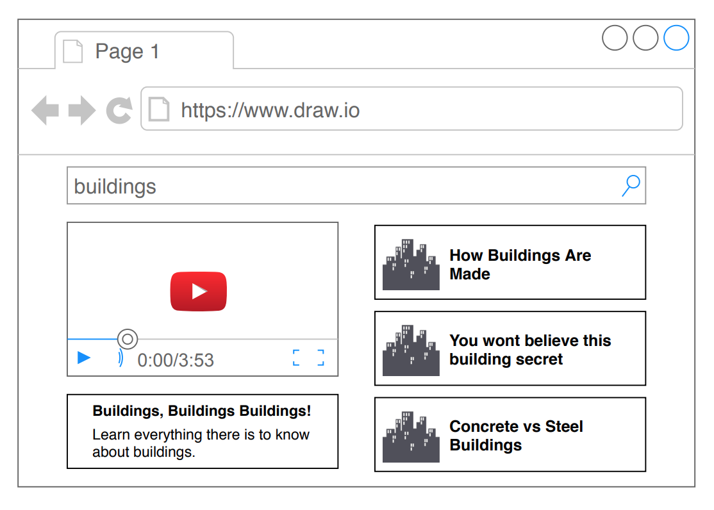
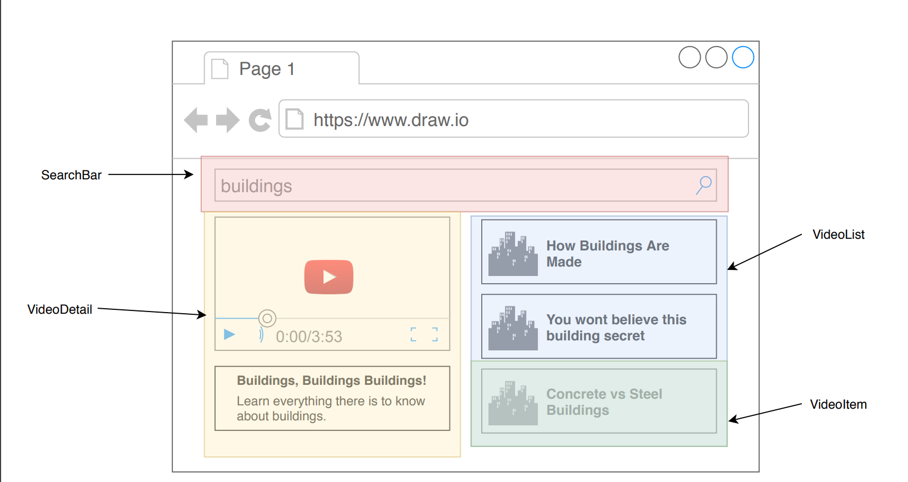
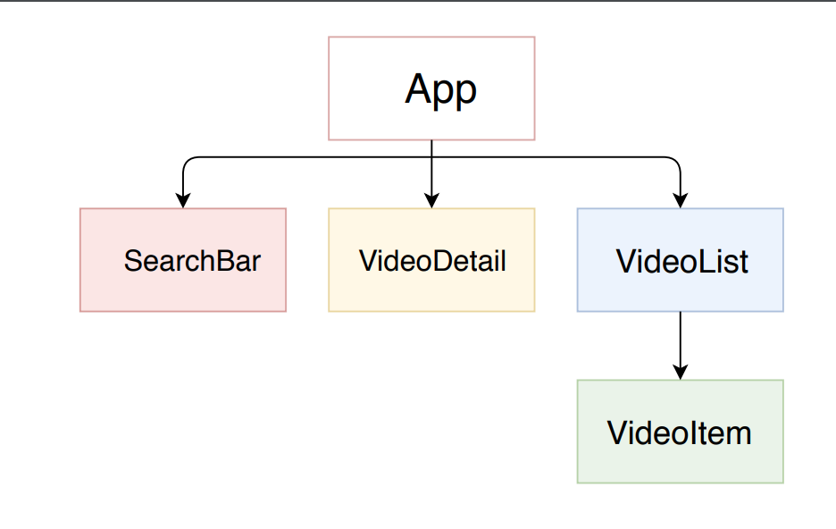

This project was bootstrapped with [Create React App](https://github.com/facebook/create-react-app).

## Available Scripts

In the project directory, you can run:

### `npm start`

Runs the app in the development mode. 
Open [http://localhost:3000](http://localhost:3000) to view it in the browser.

The page will reload if you make edits. 
You will also see any lint errors in the console.

## Learn More

You can learn more in the [Create React App documentation](https://facebook.github.io/create-react-app/docs/getting-started).

To learn React, check out the [React documentation](https://reactjs.org/).
=======
# metube
Headway - React Project

# App Overview
This is essentially going to be a YouTube browser application in code, approach and design.

At the very top a user is going to enter in some search term, for example, in this case, I used
buildings.

After the write out the search term in the search bar, the user will hit enter which is going to trigger a
search request over to the YouTube API.

Once a user gets a list of videos back from this YouTube API they will be displayed on the right hand
side of the browser. The user will then be able to click on one of these videos and it will be featured in
the top left so the user can click on the actual video. The user will be shown a video title and
description and will also be able to watch the video by clicking the play button.
So this React application will have a search bar, its going to make a request to an outside API, its
going to render a list of items which are features that any React engineer worth his salt should be
able to do.

# Component Design
So I have taken this mockup and broken it down into separate components so that I can get a good idea of what I am going to be building as I work on the application.

So the above mockup is my idea on how I am going to split this up into separate components.

I think I will have a search bar component at the top of the screen. This search bar is going to show some text input. A user can type in the search bar and this will update my state and then anytime a user hits the enter key, that will trigger a form submit event and send that search term back up to some other app component or parent component which will then take that search term and do an actual API request.

On the right hand side I will have a `VideoList` that is going to render the entire list of videos.

And then each of those individual parts or each of those individual boxes will be a component called `VideoItem`.

So if `VideoItem` is one particular video then all the video items will be contained by the `VideoList` component.

This explains why I have a green box around one `VideoItem` inside of the blue box that encompasses all the items in the `VideoList` component.

Finally, I will add the `VideoDetail` component which will be responsible for actually showing a video player that can play the actual YouTube video that has been fetched and the title and description right underneath the video.

So these are going to be the actual videos from YouTube that will be playing in this application minus the commercials.

I need to figure out how I am going to actually show a video directly from YouTube and embed it inside my application, but I suspect this will be fairly straightforward.

The last thing I want to show you below is my component hierarchy.

So at the top I am still going to have the overarching `App` component which is responsible for holding all the state of this application, for retrieving a list of videos and for storing whatever the current search term is.

The `App` is then going to configure the `SearchBar`, `VideoDetail` and `VideoList` by passing props from the App down to each of these components.

In turn, the `VideoList` component will pass some props down to the `VideoItem` component or the collection of video items.

So at the top I am still going to have the overarching `App` component which is responsible for holding all the state of this application, for retrieving a list of videos and for storing whatever the current search term is.

The `App` is then going to configure the `SearchBar`, `VideoDetail` and `VideoList` by passing props from the `App` down to each of these components.

In turn, the `VideoList` component will pass some props down to the `VideoItem` component or the collection of video items.

# Accessing the YouTube API

My React app will make use of the Axios library. It is going to make a network request over to the YouTube API looking for videos related to a search term.

The YouTube API is then going to respond with a list of videos to show on the screen. The list of videos will be an array of objects where every object represents a different video.

In order to make use of the YouTube API I have to get an API key. To get the API key I have to navigate to console.developers.google.com inside the browser and go through a setup process.
